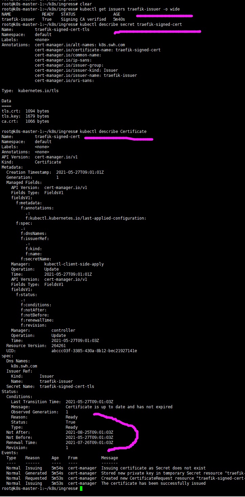

# Ingress

K8s集群内部使用`kube-dns`或`core-dns`实现服务发现的功能, K8s中将集群中的应用暴露给外部用户除了`NodePort`和
`LoadBlancer`的方式之外, K8s提供了`ingress`这个资源对象.

其本质就是从kubernetes集群外部访问集群的一个入口, 将外部的请求转发到集群内不同的Service上, 相当于nginx、haproxy
等负载均衡代理服务器. 只不过不需要像Nginx那样手动更改Nginx配置, 而是由Ingress 通过不断与kube-apiserver打交道, 
实时感知后端service、pod的变化.

## 插件列表
- [traefik](https://traefik.io/)
- [nginx-controller](https://kubernetes.github.io/ingress-nginx/)
- [Kubernetes Ingress Controller for Kong](https://konghq.com/blog/kubernetes-ingress-controller-for-kong/)
- [HAProxy Ingress controller](https://github.com/jcmoraisjr/haproxy-ingress)

目前常用较多的是`traefik`和`nginx-controller`, 前者性能较后者差, 但配置相对会比较简单.


## Traefik介绍

Traefik是一款开源的反向代理与负载均衡工具(Ingress controller). 它最大的优点是能够与常见的微服务系统直接整合, 可以实现自动化动态配置.
. [中文文档](https://www.qikqiak.com/traefik-book/)

### helm 部署
- 不暴露`dashboard`服务部署方式
    ```bash
    helm repo add traefik https://helm.traefik.io/traefik
    helm repo update
    helm install traefik traefik/traefik
    ```
    - 使用命令, 查看pod所在节点
    ```bash
    kubectl describe pod traefik-b5cf49d5b-sq7qb(your pod name)
    ```
    
    - 在该节点上运行命令暴露dashboard 的端口
    ```bash
    kubectl port-forward $(kubectl get pods --selector "app.kubernetes.io/name=traefik" --output=name) 9000:9000
    ```
- 根据[values.yaml](values.yaml)自定义部署(打上`-----------`是我修改的地方), 参考[官方 values.yaml](https://github.com/traefik/traefik-helm-chart/blob/master/traefik/values.yaml)
    ```bash
    helm repo add traefik https://helm.traefik.io/traefik
    helm repo update
    helm install traefik traefik/traefik -f values.yaml
    ```
  - 访问: 通过命令`kubectl describe pod traefik`查找部署所在的节点
  
    - 通过`http://192.168.1.116:30446`即可访问traefik的dashboard
    
    
### 设置tls访问
- 使用[cert-manager](../cert-manager/README.md)创建证书, [traefik-ca-use.yaml](traefik-ca-use.yaml)
    ```bash
    kubectl apply -f traefik-ca-use.yaml
    # 查看traefik-issuer, 如果是clusterissuers资源则是 kubectl get clusterissuers traefik-issuer -o wide
    kubectl get issuers traefik-issuer -o wide
    # 查看生成的证书secret
    kubectl describe secret traefik-signed-cert
    #查看签发的证书(`Certificate`资源)状态
    kubectl describe Certificate
    ```
    


## 参考
- [Helm3部署Traefik 2](https://www.cnblogs.com/hacker-linner/p/13632813.html)