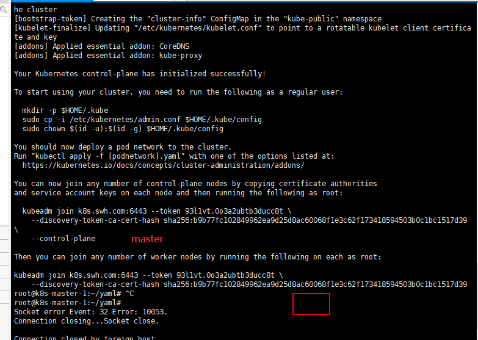

# Kubernetes集群搭建

k8s 版本为[v1.19](https://kubernetes.io/docs/home/)

## Kubernetes集群搭建
- 安装kubeadm、kubelet、kubectl
    ```bash
    sudo apt-get update && sudo apt-get install -y apt-transport-https curl
    ```
  - 官方源
    ***
    [apt-key.gpg](apt-key.gpg), ubuntu下使用[vpn client](vpn-use.md)
    ```bash
    # google 官方源
    # 如果出现gpg: no valid OpenPGP data found错误. 是因为需要翻墙下载apt-key.gpg. 
    # 可选择访问https://packages.cloud.google.com/apt/doc/apt-key.gpg手动下载gpg文件. 地址: doc/kubernetes/files下
    # 再执行apt-key add apt-key.gpg
    curl -s https://packages.cloud.google.com/apt/doc/apt-key.gpg | apt-key add -
    ```
    ***
    ```bash
    cat <<EOF >/etc/apt/sources.list.d/kubernetes.list
    deb https://apt.kubernetes.io/ kubernetes-xenial main
    EOF
    # 阿里源
    echo "deb https://mirrors.aliyun.com/kubernetes/apt kubernetes-xenial main" >> /etc/apt/sources.list
    # 安装kubeadm等
    apt-get update
    # google 所用
    # apt-get install -y kubelet kubeadm kubectl
    apt-get install -y kubelet kubeadm kubectl --allow-unauthenticated
    # hold kubelet kubeadm kubectl的版本号, 不更新, 可使用unhold取消
    apt-mark hold kubelet kubeadm kubectl
    # 重启kubelet
    systemctl daemon-reload
    systemctl restart kubelet
    systemctl status kubelet
    ```
    - 或者使用[阿里源](https://developer.aliyun.com/mirror/kubernetes?spm=a2c6h.13651102.0.0.3e221b11i4VEO5)

### 初始化第一个master节点
- 初始化master节点, 使用[kubeadm-config.yaml](yaml/kubeadm-config.yaml), [参考](https://kubernetes.io/docs/reference/setup-tools/kubeadm/kubeadm-init/#config-file)
```bash
kubeadm config images pull --config kubeadm-config.yaml
# 初始化master节点
kubeadm init --config kubeadm-config.yaml
# 也可用命令的形式初始化master节点 kubeadm init --image-repository gcr.azk8s.cn/google_containers --kubernetes-version v1.19.1 --pod-network-cidr=192.168.0.0/16
```
- 成功后, 保留`kubeadm join`, 以供构建集群使用, 
```bash
# master节点加入
kubeadm join k8s.swh.com:6443 --token vsag22.2grzmjuyo1vrrm2h \
--discovery-token-ca-cert-hash sha256:24700c9635dc732869d1c5aab7d98e59e2fd85fb8531a6fa6ff59a2bdb63b5d3 \
--control-plane 

# node节点加入
kubeadm join k8s.swh.com:6443 --token vsag22.2grzmjuyo1vrrm2h \
    --discovery-token-ca-cert-hash sha256:24700c9635dc732869d1c5aab7d98e59e2fd85fb8531a6fa6ff59a2bdb63b5d3
```
- 将kubeConfig置入环境变量
```bash
# 临时
export KUBECONFIG=/etc/kubernetes/admin.conf
# 永久
echo "export KUBECONFIG=/etc/kubernetes/admin.conf" >> /root/.bashrc
source /root/.bashrc
```
- 安装calico网络插件, [参考](https://docs.projectcalico.org/getting-started/kubernetes/quickstart)
    - 下载calico网络插件配置信息, 并修改`CALICO_IPV4POOL_CIDR`值为`kubeadm-config.yaml`的podSubnet值.
    修改后的[calico.yaml](yaml/calico.yaml)文件
    ```bash
    wget https://docs.projectcalico.org/manifests/calico.yaml
    # 修改后安装calico网络插件
    kubectl apply -f calico.yaml
    ```
  
  
### 加入其它master节点构成集群
- 新节点参照上述步骤安装好docker、kubeadm、kubelet、kubectl后
- 使用[脚本](sh/sync.master.ca.sh)将ca证书从源节点拷贝至其他节点
- 使用kubeadm join命令将节点加入master集群
```bash
# 将kubeConfig永久置入环境变量
echo "export KUBECONFIG=/etc/kubernetes/admin.conf" >> /root/.bashrc
source /root/.bashrc
# 使用token作为control node加入k8s master 集群
  # kubeadm join master
```

### 加入其它node节点构成工作集群


## 遇到的一些问题
- [root用户无法远程连接解决方案](https://blog.csdn.net/qq_35445306/article/details/78771398)
    - 修改 `/etc/ssh/sshd_config` 文件把`PermitRootLogin Prohibit-password`添加#注释掉, 并添加`PermitRootLogin yes`.
    重启ssh`/etc/init.d/ssh restart`
    - 同时使用命令`passwd root`设置root命令
    
    
## 参考
- [k8s集群部署操作手册](k8s集群部署操作手册.pdf)
- [Ubuntu物理节点上部署kubernetes集群](https://www.kubernetes.org.cn/doc-17)
- [Kubeadm配置多Master](https://my.oschina.net/baobao/blog/3031712)