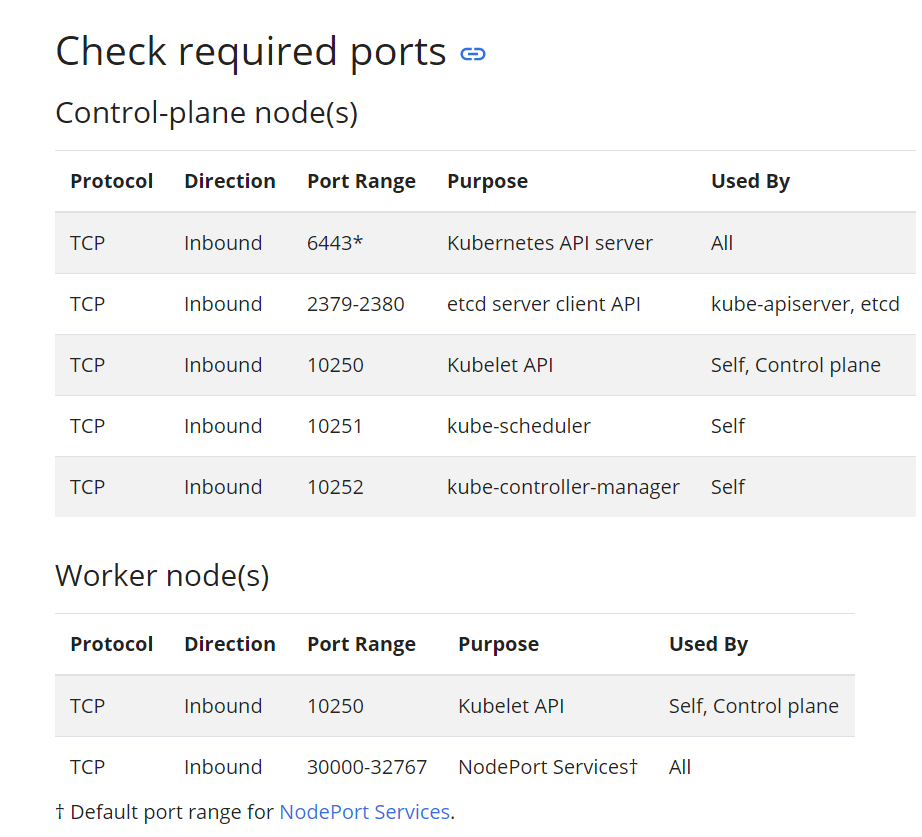
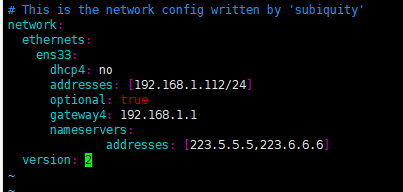
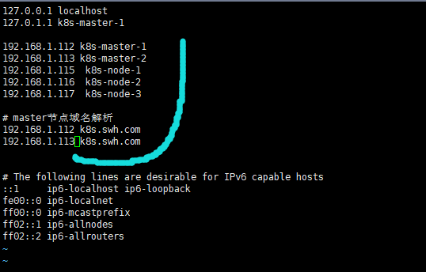

# 准备

## 环境配置

### Step1: 创建虚拟机

**注意**: kubernetes要求如下
***
- ubuntu16.04+
- 2GB+ RAM per machine. Any less leaves little room for your apps.(can low than that)
- 2 CPU or more on the control-plane node
- Full network connectivity between all machines in the cluster (public or private network is fine)
- Unique hostname, MAC address, and product_uuid for every node.
```bash
    # 检查MAC address唯一性
    ifconfig -a
    # 检查product_uuid唯一性
    sudo cat /sys/class/dmi/id/product_uuid
```
- Certain ports are open on your machines.
    
- Swap disabled. You MUST disable swap in order for the `kubelet` to work properly
```bash
    # 查看swap是否关闭
    swapon --show
    # 临时关闭
    swapoff -a
    # 或永久关闭------------------, 也可将swapoff -a命令写入.bashrc
    # 将根目录文件系统设为可读写
    mount -n -o remount,rw /
    # 修改/etc/fstab文件, 注释掉swap分区后重启系统
    #/swap.img      none    swap    sw      0       0            swap    sw              0       0
```

***
- 固定虚拟机ip, 使用静态ip, [参考](https://www.cnblogs.com/kehoudaanxianjie/p/13139636.html)
    - 修改`/etc/netplan`目录下的`.yaml`文件, 修改成静态ip模式
    
    ```bash
    netplan apply
    ```
    

本示例所使用的虚拟机
- 创建使用[ubuntu 20.04.1](https://ubuntu.com/download/server)
    - 开启root登录
        - `vim /etc/ssh/sshd_config` 修改 `PermitRootLogin yes`(默认为#PermitRootLogin prohibit-password), 
        - 再 `service ssh restart`(可能需要修改root密码`sudo passwd root`)
- 网络使用桥接模式(直接复制物理机信息)
    - DHCP分配的`k8s master 1` ip为`192.168.1.112`
    - DHCP分配的`k8s master 2` ip为`192.168.1.113`
    - DHCP分配的`k8s node 1` ip为`192.168.1.115.`
    - DHCP分配的`k8s node 2` ip为`192.168.1.116`
    - DHCP分配的`k8s node 3` ip为`192.168.1.117`

### Step2: 修改节点名称(模拟域名形式)
- 对于master节点
    - 将`/etc/hostname`内主机名修改成`k8s-master-1`
        ```bash
          # 也可用命令
          hostnamectl set-hostname k8s-master-1
        ```
    - 修改`/etc/hosts`
        ```bash
        # 将`127.0.1.1  ubuntu`修改成
        127.0.1.1 hostname(k8s-master-1)
        192.168.1.112  k8s-master-1
        192.168.1.113  k8s-master-2
        192.168.1.115  k8s-node-1
        192.168.1.116  k8s-node-2
        192.168.1.117  k8s-node-3
        
        # master节点域名解析涉及负载均衡(本示例并没有实现LB, 这边只用了两台, 生产环境中至少三台) 
        192.168.1.112  k8s.swh.com
        192.168.1.113  k8s.swh.com
        ```
      
- 同理, 对worker node节点做同样修改, 名称可随意(如: k8s_node_1)
    
## Step3: 网络相关配置
- 添加路由转发
    ```bash
    # vim /etc/sysctl.d/k8s.conf, 新建路由转发
        # 配置转发参数
        net.bridge.bridge-nf-call-ip6tables=1
        net.bridge.bridge-nf-call-iptables=1
        net.ipv4.ip_forward=1
        
    # 执行以下命令生效
    modprobe br_netfilter
    sysctl -p /etc/sysctl.d/k8s.conf
    ```
  
## Step4: 安装[docker](docker.md)

    
~~以下所有虚拟机环境配置写入至[init.sh](init.sh)脚本中~~