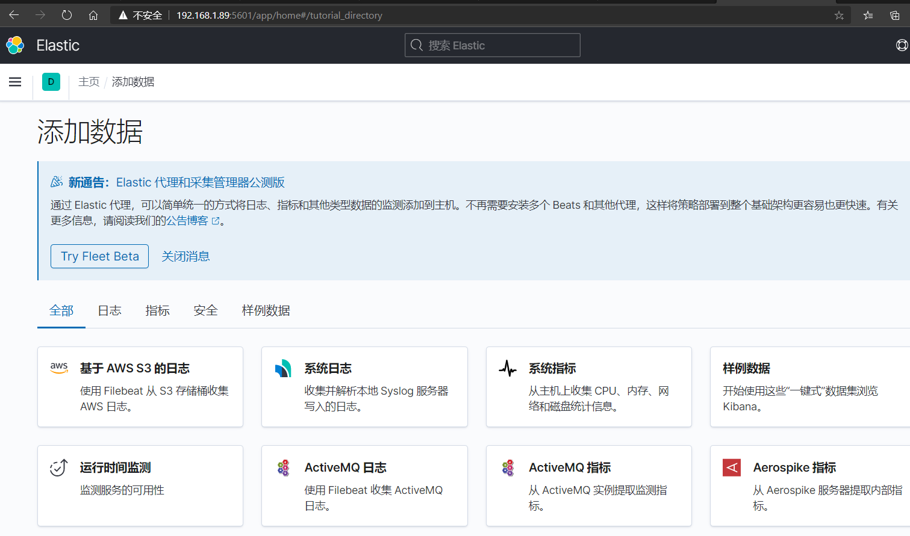

# EFk 日志收集系统搭建及使用

EFK指的是[Elasticsearch](https://www.elastic.co/guide/en/elasticsearch/reference/current/index.html) + 
[Filebeat](https://www.elastic.co/guide/en/beats/filebeat/7.10/index.html) + 
[Kibana](https://www.elastic.co/guide/en/kibana/7.10/settings.html)
- elasticsearch: 是一个天然的分布式文档存储中间件, 它使用倒排索引的数据结构, 支持快速全文搜索.
- kibana: 集成了`elasticsearch`中的安全、监控和管理功能, 用作web端管理界面.

## 搭建

### 单节点

根据目前服务需求暂时不需要使用集群, 因此决定采用单节点使用, [docker-compose.yml](yml/docker-compose.yml)
```bash
# 挂载目录赋予权限
mkdir data
chmod +777 data
docker-compose up -d
```
访问端口`5601`即可访问


### 集群使用
~~根据官方文档搭建目前还有点问题, kibana无法连接至es集群， 暂时不用~~
- [elasticsearch集群搭建](elasticsearch.md)
- [kibana搭建](kibana.md)

## kubernetes
[Download Elastic Cloud on Kubernetes](https://www.elastic.co/cn/downloads/elastic-cloud-kubernetes)

## security
[免费安全版本](https://www.elastic.co/cn/blog/security-for-elasticsearch-is-now-free)

## 参考
- [一键构建单节点ek](https://github.com/wachira90/kibana7101-elastic7101)
- [elasticsearch cluster and kibana build](https://github.com/cocowool/sh-valley/tree/master/docker-conf/elasticstack/cluster)